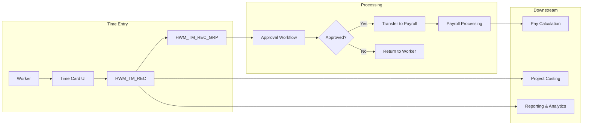
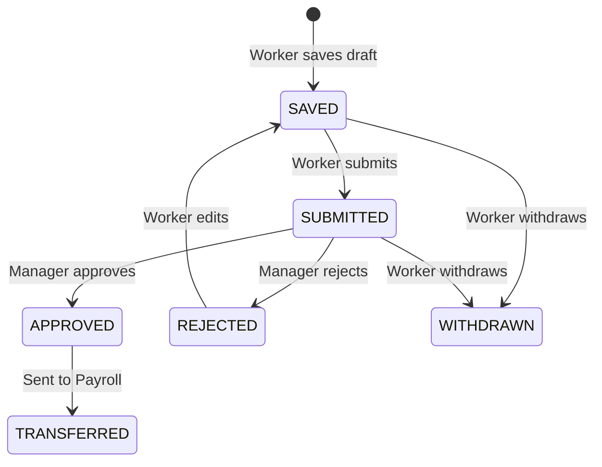

## What is Oracle Time and Labor?

Oracle Time and Labor (OTL) is a module within Oracle Fusion HCM Cloud that enables organizations to capture, manage, and process **worker time data**. It's part of the broader Workforce Management suite.

OTL handles:
- **Time entry** — Workers record their hours via time cards
- **Approval workflows** — Managers review and approve time cards
- **Time reporting** — Analytics on worked hours
- **Payroll integration** — Feeds approved time to Payroll for processing
- **Project costing** — Allocates time to projects and tasks

## Architecture Overview

## Key Concepts

### Time Records vs Time Record Groups

| Concept | Table | Description |
|---|---|---|
| **Time Record** | `HWM_TM_REC` | Individual time building block — a single entry of hours/range |
| **Record Group** | `HWM_TM_REC_GRP` | Groups records into logical sets (a weekly time card) |
| **Statuses** | `HWM_TM_STATUSES` | Lookup table defining valid lifecycle statuses |

### Time Entry Methods

OTL supports multiple time entry methods:

1. **Calendar-based** — Workers enter hours on a weekly calendar grid
2. **Start/Stop** — Workers clock in and out with actual timestamps
3. **Quantity-based** — Workers enter quantities (hours, units, etc.)
4. **Elapsed** — Workers enter total elapsed time

### Time Card Statuses

## Key Tables at a Glance

### OTL Data Tables (HWM_ prefix)

| Table | Purpose |
|---|---|
| `HWM_TM_REC` | Core time records / building blocks |
| `HWM_TM_REC_GRP` | Groups time records into time cards |
| `HWM_TM_STATUSES` | Status lookup / reference data |

### WFM UI Tables (HXT_ prefix)

| Table | Purpose |
|---|---|
| `HXT_TM_HEADER` | Time matrix header (UI-level container) |
| `HXT_TM_MTRX` | Time matrix detail rows (grid data) |
| `HXT_TCLAY_B` | Time card layout configuration |
| `HXT_APRV_TXN_HEADER` | Approval transaction header |
| `HXT_APRV_TXN_DETAILS` | Approval transaction detail lines |

### Core HR Tables (PER_ prefix)

| Table | Purpose |
|---|---|
| `PER_ALL_PEOPLE_F` | Person master — who the worker is |
| `PER_ALL_ASSIGNMENTS_M` | Assignment master — what the worker does |

## Integration Points

OTL integrates with several Oracle Fusion modules:

- **Payroll** — Approved time entries are transferred for pay calculation
- **Project Management** — Time is allocated to projects and tasks for costing
- **Absence Management** — Absence entries may appear in time cards
- **Global HR** — Person and assignment data provides worker context
- **Approvals** — BPM workflows manage the approval process

## Common Business Scenarios

### 1. Weekly Time Card Submission
A worker enters their hours for the week (Mon-Fri), adds project codes, and submits. Their manager receives an approval notification.

### 2. Time Transfer to Payroll
After approval, a batch process runs to transfer approved time entries to the Payroll module for the next pay run.

### 3. Overtime Tracking
Rules are configured to automatically flag entries exceeding 8 hours/day or 40 hours/week for overtime calculation.

## Tips for Developers

> **Table prefix guide**: `HWM_` tables store the actual time data. `HXT_` tables handle the UI layer and approval workflow. `PER_` tables provide person and assignment context.

> **Query Pattern**: Always start from `HWM_TM_REC` for data queries or `HXT_TM_HEADER` for UI-perspective queries. Join to `PER_ALL_PEOPLE_F` for person details.

> **Date Filters**: When querying historical data, always use date ranges on `HWM_TM_REC.REF_DATE` or `HXT_TM_HEADER.PERIOD_START_DATE` to limit results.

> **Status Filtering**: Common filters are `USER_STATUS = 'APPROVED'` for downstream processing and `USER_STATUS = 'SUBMITTED'` for pending approval queries.
