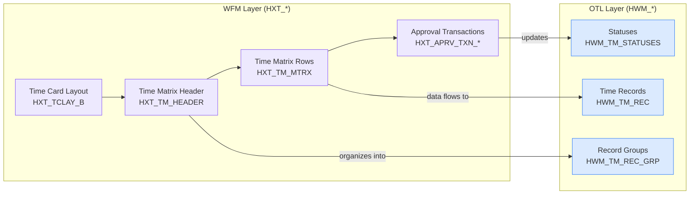

## What is Workforce Management?

Oracle Workforce Management (WFM) is a suite of tools within HCM Cloud that handles the **operational side** of managing workers' time, schedules, and absence. While OTL (Time and Labor) focuses on time entry and processing, WFM takes a broader view:

- **Time card configuration** — How time cards look and behave
- **Time matrices** — Structured grids for time entry
- **Scheduling** — Shift patterns and work schedules
- **Approval workflows** — Routing time cards through management
- **Analytics** — Labor cost analysis and compliance

## WFM vs OTL — What's the Difference?

This is a common source of confusion. Here's the simple breakdown:

| Aspect | OTL (Time and Labor) | WFM (Workforce Management) |
|---|---|---|
| **Focus** | Time data processing | Time card UI and workflows |
| **Tables** | `HWM_*` prefix | `HXT_*` prefix |
| **Think of it as** | The engine | The dashboard |
| **Main job** | Store and process time | Configure and present time |

In practice, they work together seamlessly:

## Key WFM Tables

| Table | What It Does |
|---|---|
| `HXT_TCLAY_B` | Defines time card UI layouts (which fields, what order) |
| `HXT_TM_HEADER` | Time matrix header — one per person per period |
| `HXT_TM_MTRX` | Time matrix rows — the actual grid data workers fill in |
| `HXT_APRV_TXN_HEADER` | Approval transaction header (the "envelope") |
| `HXT_APRV_TXN_DETAILS` | Approval transaction lines (the "contents") |

## Common WFM Scenarios

### 1. Configuring a New Time Card Layout

When you need different time card layouts for different worker groups:

1. Define fields in `HXT_TCLAY_B`
2. Set `DISPLAY_SEQUENCE` for ordering
3. Mark mandatory fields with `MANDATORY_FLAG = 'Y'`
4. Set effective dates for go-live

### 2. Investigating Missing Time Cards

When a worker says "I can't see my time card":

1. Check `HXT_TM_HEADER` — is there a matrix for this period?
2. Check the `LAYOUT_ID` — is the right layout assigned?
3. Check `PER_ALL_ASSIGNMENTS_M` — is the assignment active?
4. Check the worker's eligibility rules

### 3. Approval Bottlenecks

When time cards are stuck in approval:

1. Query `HXT_APRV_TXN_HEADER` for `PENDING` status
2. Check `SUBMISSION_DATE` — how long has it been waiting?
3. Look at `APPROVER_ID` — is the manager active?
4. Check BPM workflow for stuck tasks

## Tips for Developers

> **Prefix guide**: `HWM_` = Oracle Time and Labor data tables. `HXT_` = Workforce Management / time card UI tables. Learn this pattern and you'll instantly know which area you're working in.

> **Configuration changes**: WFM layout changes (`HXT_TCLAY_B`) take effect based on effective dates. Workers won't see changes until the effective date arrives — or until they create a *new* time card for the affected period.

> **Integration order**: When building reports, start from the WFM layer (`HXT_TM_HEADER` → `HXT_TM_MTRX`) for the user-facing view, or from the OTL layer (`HWM_TM_REC`) for the processed/system view. They represent the same data from different perspectives.
