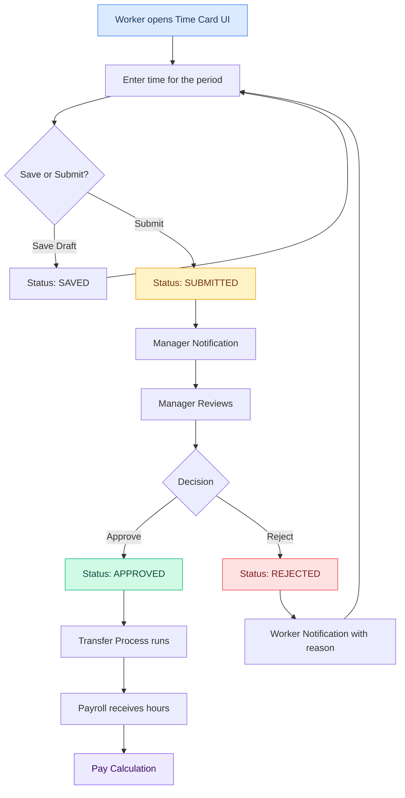
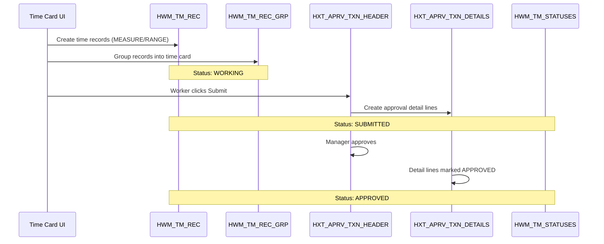

## Overview

The time card submission flow describes the end-to-end process of how a worker's time data moves from initial entry through approval and finally to downstream systems like Payroll.

This is one of the most critical business processes in the OTL module.

## Flow Diagram



## What Happens in the Database

Understanding which tables are affected at each step helps with debugging and building integrations.



## Step-by-Step Details

### 1. Time Card Creation

The worker accesses the Time and Labor UI and creates or opens a time card for the current period.

**What happens in the database:**
- A new row is inserted into `HWM_TM_REC` for each time entry
- Records are grouped via `HWM_TM_REC_GRP`
- The time matrix is tracked in `HXT_TM_HEADER` and `HXT_TM_MTRX`

```sql
-- Each day's entry becomes a time record
SELECT 
    r.TM_REC_ID,
    r.REF_DATE,
    r.MEASURE,
    r.TM_REC_TYPE,
    r.USER_STATUS
FROM 
    HWM_TM_REC r
WHERE 
    r.RESOURCE_ID = :person_id
    AND r.USER_STATUS = 'WORKING'
ORDER BY 
    r.REF_DATE;
```

### 2. Time Entry

The worker enters hours for each day. Each entry creates rows in both `HWM_TM_REC` (data layer) and `HXT_TM_MTRX` (UI layer).

**Key data captured:**
- Date (`REF_DATE` in `HWM_TM_REC`)
- Hours worked (`MEASURE`)
- Project/task codes (via DFF attributes or `HXT_TM_MTRX` columns)
- Pay type (Regular, Overtime, etc.)

### 3. Submission

When the worker submits the time card:
- `USER_STATUS` changes from `WORKING` to `SUBMITTED` in `HWM_TM_REC`
- A header row is created in `HXT_APRV_TXN_HEADER`
- Detail lines are created in `HXT_APRV_TXN_DETAILS` for each time entry
- An approval workflow is triggered via Oracle BPM
- The manager receives a notification

### 4. Approval

The manager reviews the time card and can:
- **Approve** → Status becomes `APPROVED`
- **Reject** → Status becomes `REJECTED` (with comments in `HXT_APRV_TXN_HEADER.COMMENTS`)
- **Request Information** → Worker is asked for clarification

### 5. Transfer to Payroll

After approval, a batch process (Transfer Time Card Data):
- Reads all `APPROVED` time records
- Creates corresponding payroll elements
- Marks records as `TRANSFERRED`

```sql
-- Find approved time ready for transfer
SELECT 
    r.TM_REC_ID,
    r.REF_DATE,
    r.MEASURE,
    p.PERSON_NUMBER
FROM 
    HWM_TM_REC r
    JOIN PER_ALL_PEOPLE_F p ON r.RESOURCE_ID = p.PERSON_ID
        AND SYSDATE BETWEEN p.EFFECTIVE_START_DATE AND p.EFFECTIVE_END_DATE
WHERE 
    r.USER_STATUS = 'APPROVED'
    AND r.REF_DATE >= :payroll_period_start;
```

## Validation Rules

During submission, the system validates:

| Rule | Description | Example |
|---|---|---|
| **Period Completeness** | All days in the period must have entries | Mon-Fri must have entries |
| **Maximum Hours** | Daily hours cannot exceed configured max | Max 24 hours/day |
| **Required Fields** | Mandatory DFF attributes must be filled | Project code required |
| **Duplicate Check** | No duplicate entries for same day/type | Can't enter Regular twice for Monday |

## Error Handling

Common error scenarios and their resolutions:

1. **Submission Fails** — Usually due to validation errors. Check validation rules above.
2. **Approval Timeout** — If no action within configured days, auto-escalation occurs.
3. **Transfer Failure** — Payroll element mapping issues. Check element configuration.

## Tables Involved in This Flow

| Step | Tables Written To | Tables Read From |
|---|---|---|
| Create | `HWM_TM_REC`, `HWM_TM_REC_GRP`, `HXT_TM_HEADER`, `HXT_TM_MTRX` | `PER_ALL_PEOPLE_F`, `PER_ALL_ASSIGNMENTS_M`, `HXT_TCLAY_B` |
| Submit | `HXT_APRV_TXN_HEADER`, `HXT_APRV_TXN_DETAILS` | `HWM_TM_REC`, `HWM_TM_STATUSES` |
| Approve | `HXT_APRV_TXN_HEADER`, `HXT_APRV_TXN_DETAILS`, `HWM_TM_REC` | `HWM_TM_STATUSES` |
| Transfer | `HWM_TM_REC` (status update) | All of the above |

## Related Processes

- **Auto-submit rules** — Time cards can be auto-submitted if configured
- **Delegate entry** — Managers can enter time on behalf of workers
- **Mass approval** — Managers can approve multiple time cards at once
- **Time card templates** — Workers can create reusable templates for recurring patterns
