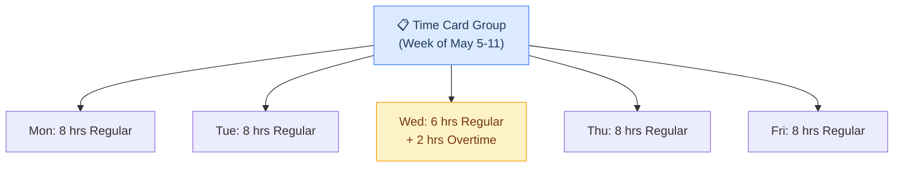

## What Is This Table?

`HWM_TM_REC_GRP` is the **grouping layer** for time records. If `HWM_TM_REC` stores individual time blocks, this table organizes them into logical groups — essentially creating the "time card" that a worker sees in the UI.

Think of it as a folder: when a worker opens their weekly time card, that entire time card is represented as a **record group**. All the individual time entries (Monday 8 hrs, Tuesday 8 hrs, etc.) are time records (`HWM_TM_REC`) that belong to this group.

## Why Does This Matter?

Without this table, you'd have thousands of individual time records floating around with no structure. The record group provides:

- **Hierarchy**: Groups time records into meaningful sets (a weekly time card, a project allocation, etc.)
- **Scope**: Defines the date range and type of the grouping
- **Lifecycle**: Tracks the overall status of the grouped time entries

> **Pro tip**: When debugging why a time card isn't showing up for a worker, start here. If there's no record group for the period, the individual time records won't render in the UI.

## Key Columns

| Column | Type | What It Means |
|---|---|---|
| `TM_REC_GRP_ID` | NUMBER | Primary key — uniquely identifies this group. |
| `GRP_TYPE_ID` | NUMBER | Defines the *type* of grouping (weekly card, project group, etc.). |
| `PARENT_GRP_ID` | NUMBER | If this group is nested inside another group, this points to the parent. Enables hierarchical grouping. |
| `ENTERPRISE_ID` | NUMBER | Business unit / enterprise context. |
| `RESOURCE_ID` | NUMBER | The person who owns this group of time records. |
| `RESOURCE_TYPE` | VARCHAR2(30) | Usually `'PERSON'`. |
| `START_DATE` | DATE | Start of the time period this group covers. |
| `END_DATE` | DATE | End of the time period. |
| `GRP_STATUS` | VARCHAR2(30) | Overall status of the group (WORKING, SUBMITTED, APPROVED, etc.). |
| `DESCRIPTION` | VARCHAR2(240) | Optional free-text description. |

### Audit Columns

| Column | Type |
|---|---|
| `CREATED_BY` | VARCHAR2(64) |
| `CREATION_DATE` | TIMESTAMP |
| `LAST_UPDATED_BY` | VARCHAR2(64) |
| `LAST_UPDATE_DATE` | TIMESTAMP |
| `OBJECT_VERSION_NUMBER` | NUMBER |

## How the Hierarchy Works



Each box at the bottom is a `HWM_TM_REC` row. The top box is a `HWM_TM_REC_GRP` row that ties them all together.

## Common Queries

### Find all time card groups for a person in a date range

```sql
SELECT 
    g.TM_REC_GRP_ID,
    g.START_DATE,
    g.END_DATE,
    g.GRP_STATUS,
    COUNT(r.TM_REC_ID) AS entry_count,
    SUM(r.MEASURE) AS total_hours
FROM 
    HWM_TM_REC_GRP g
    LEFT JOIN HWM_TM_REC r ON r.GRP_TYPE_ID = g.GRP_TYPE_ID
WHERE 
    g.RESOURCE_ID = :person_id
    AND g.START_DATE >= :period_start
    AND g.END_DATE <= :period_end
GROUP BY 
    g.TM_REC_GRP_ID, g.START_DATE, g.END_DATE, g.GRP_STATUS
ORDER BY 
    g.START_DATE DESC;
```

### Identify orphaned records (time records without a group)

```sql
SELECT 
    r.TM_REC_ID,
    r.RESOURCE_ID,
    r.REF_DATE,
    r.MEASURE
FROM 
    HWM_TM_REC r
    LEFT JOIN HWM_TM_REC_GRP g ON r.GRP_TYPE_ID = g.GRP_TYPE_ID
WHERE 
    g.TM_REC_GRP_ID IS NULL
    AND r.REF_DATE >= ADD_MONTHS(SYSDATE, -3);
```

## Developer Tips

- **Parent-child groups**: Groups can be nested. A monthly summary group might contain four weekly time card groups. Check `PARENT_GRP_ID` for this hierarchy.
- **Status mismatch**: A group can show `APPROVED` even if individual records within it were modified after approval. Always cross-check with `HWM_TM_REC.USER_STATUS`.
- **Date boundaries**: `START_DATE` and `END_DATE` define the *intended* period, not necessarily when entries exist. A weekly card might have `START_DATE = Monday` and `END_DATE = Sunday`, but the worker only entered time for Mon-Fri.
