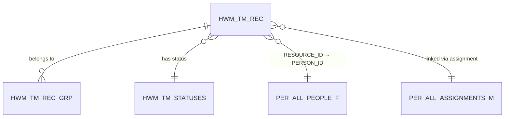

## What Is This Table?

Think of `HWM_TM_REC` as the **core building block** of Oracle Time and Labor. Every time a worker records their hours — whether it's 8 hours on a Monday, a lunch break, or an overtime entry — it ends up here.

Oracle uses a "building block" architecture for time data. Instead of storing a simple flat row per day, each time entry is a **time record** (or "building block") that can be nested into groups. This gives enormous flexibility — you can have:

- A **day-level** block that contains the total hours worked
- A **detail-level** block that breaks down the hours by project/task
- A **range** block that tracks clock-in/clock-out times

## Why Should You Care?

If you're working with OTL data — whether it's building reports, debugging time card issues, or integrating with downstream systems — this table is your starting point. It's where the actual time data lives.

> **Real talk**: This table can grow *fast*. In production environments with thousands of workers submitting weekly time cards, you'll easily see millions of rows. Always filter by date ranges.

## Key Columns

| Column | Type | What It Means |
|---|---|---|
| `TM_REC_ID` | NUMBER | Primary key. Auto-generated, never changes once created. |
| `TM_REC_ROW_ID` | NUMBER | Unique row tracker, especially important for payroll processing status. |
| `TM_REC_VERSION` | NUMBER | Version number — increments when the record is modified. Think of it as the "edit count." |
| `GRP_TYPE_ID` | NUMBER | FK to the group type this record belongs to (see `HWM_TM_REC_GRP`). |
| `ENTERPRISE_ID` | NUMBER | Links to the enterprise/business unit. |
| `TM_REC_TYPE` | VARCHAR2(30) | Either `'RANGE'` (clock-in/out style) or `'MEASURE'` (hours-based entry). |
| `ACTIVITY_TYPE` | VARCHAR2(30) | What kind of activity this is (Regular, Overtime, etc.). |
| `MEASURE` | NUMBER | The actual time value — usually hours worked. |
| `UNIT_OF_MEASURE` | VARCHAR2(30) | Almost always `'HOURS'` but could theoretically be other units. |
| `START_TIME` | TIMESTAMP | For RANGE-type records: when the worker clocked in. |
| `STOP_TIME` | TIMESTAMP | For RANGE-type records: when the worker clocked out. |
| `REF_DATE` | DATE | The logical date this record belongs to. Important when shifts span midnight. |
| `USER_STATUS` | VARCHAR2(30) | Status from the user's perspective (SUBMITTED, APPROVED, etc.). |
| `APPROVAL_STATUS` | VARCHAR2(30) | Current approval workflow status. |
| `RESOURCE_ID` | NUMBER | The person (worker) who owns this time record. |
| `RESOURCE_TYPE` | VARCHAR2(30) | Usually `'PERSON'` — identifies the type of resource. |

### Who Column Audit Fields

| Column | Type | Purpose |
|---|---|---|
| `CREATED_BY` | VARCHAR2(64) | User who created the row |
| `CREATION_DATE` | TIMESTAMP | When the row was created |
| `LAST_UPDATED_BY` | VARCHAR2(64) | User who last modified the row |
| `LAST_UPDATE_DATE` | TIMESTAMP | When the row was last modified |
| `OBJECT_VERSION_NUMBER` | NUMBER | Optimistic locking — prevents concurrent update conflicts |

## How It Connects to Other Tables



## Common Queries

### Find all time records for a specific person this week

```sql
SELECT 
    r.TM_REC_ID,
    r.REF_DATE,
    r.MEASURE,
    r.UNIT_OF_MEASURE,
    r.TM_REC_TYPE,
    r.USER_STATUS
FROM 
    HWM_TM_REC r
WHERE 
    r.RESOURCE_ID = :person_id
    AND r.REF_DATE BETWEEN TRUNC(SYSDATE, 'IW') AND TRUNC(SYSDATE, 'IW') + 6
ORDER BY 
    r.REF_DATE;
```

### Summarize total hours by status

```sql
SELECT 
    r.USER_STATUS,
    COUNT(*) AS record_count,
    SUM(r.MEASURE) AS total_hours
FROM 
    HWM_TM_REC r
WHERE 
    r.REF_DATE BETWEEN :start_date AND :end_date
    AND r.TM_REC_TYPE = 'MEASURE'
GROUP BY 
    r.USER_STATUS
ORDER BY 
    total_hours DESC;
```

## Developer Tips

- **RANGE vs MEASURE**: If you see `TM_REC_TYPE = 'RANGE'`, look at `START_TIME` and `STOP_TIME`. If it's `'MEASURE'`, look at the `MEASURE` column for the hours value.
- **REF_DATE is your friend**: When a night shift worker clocks in at 10 PM and clocks out at 6 AM, `REF_DATE` tells you which *logical day* this record belongs to. Always use this for reporting, not `START_TIME`.
- **Version tracking**: `TM_REC_VERSION` is different from `OBJECT_VERSION_NUMBER`. The version tracks the "business version" of the time block, while OVN handles database-level locking.
- **Performance**: Index scans on `RESOURCE_ID + REF_DATE` are your best bet for person-specific queries.
