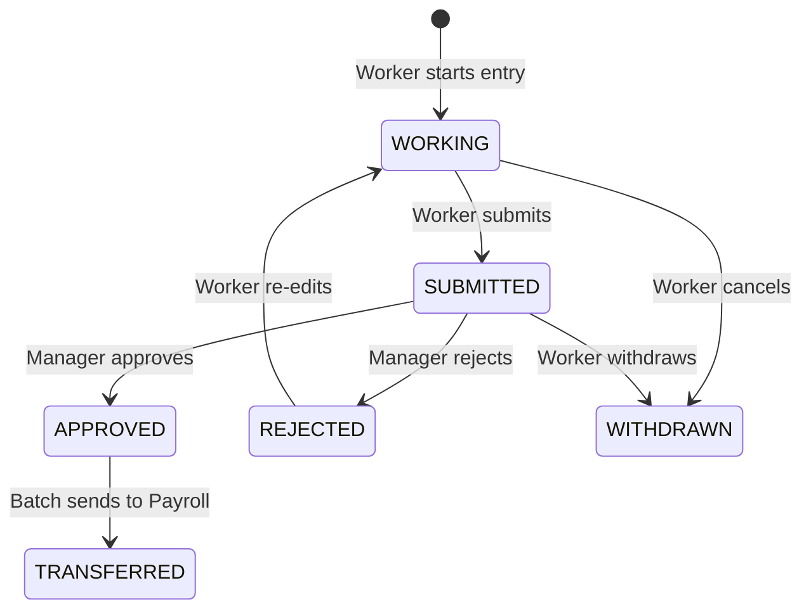

## What Is This Table?

`HWM_TM_STATUSES` is a **reference/lookup table** that defines the valid statuses a time record can go through. Rather than hardcoding status strings everywhere, Oracle maintains a master list of statuses in this table.

Think of it as the "dictionary" for time card statuses — it tells you what `WORKING`, `SUBMITTED`, `APPROVED`, and other statuses actually mean, and what transitions are allowed.

## Why Does This Matter?

When you're querying time records and see a `USER_STATUS` value like `'SUBMITTED'`, this table provides the metadata around that status:

- What's the display name?
- Is it a terminal state (i.e., can further changes happen)?
- What's the sequence in the workflow?

> **Heads up**: Oracle can add new statuses in patches. Don't hardcode status values in your integrations — always join to this table or use a lookup approach.

## Key Columns

| Column | Type | What It Means |
|---|---|---|
| `STATUS_ID` | NUMBER | Primary key. |
| `STATUS_CODE` | VARCHAR2(30) | The short code (e.g., `WORKING`, `SUBMITTED`, `APPROVED`, `REJECTED`). |
| `STATUS_NAME` | VARCHAR2(80) | Human-readable display name. |
| `STATUS_TYPE` | VARCHAR2(30) | Categorization of the status type. |
| `SEQUENCE_NUMBER` | NUMBER | Ordering — where this status falls in the workflow progression. |
| `ACTIVE_FLAG` | VARCHAR2(1) | `Y` or `N` — whether this status is currently in use. |
| `ENTERPRISE_ID` | NUMBER | Enterprise context. |

## Common Status Values

Here's what you'll typically see in a production environment:



| Status Code | What Happens | Who Triggers It |
|---|---|---|
| `WORKING` | Time card is being drafted | Worker (automatic on create) |
| `SUBMITTED` | Sent for manager approval | Worker clicks Submit |
| `APPROVED` | Manager signed off | Manager in approval workflow |
| `REJECTED` | Sent back with comments | Manager in approval workflow |
| `WITHDRAWN` | Cancelled by worker | Worker pulls back submission |
| `TRANSFERRED` | Sent to Payroll/downstream | Batch process |

## Common Queries

### List all active statuses

```sql
SELECT 
    STATUS_CODE,
    STATUS_NAME,
    SEQUENCE_NUMBER
FROM 
    HWM_TM_STATUSES
WHERE 
    ACTIVE_FLAG = 'Y'
ORDER BY 
    SEQUENCE_NUMBER;
```

### Count time records by status with readable names

```sql
SELECT 
    s.STATUS_NAME,
    COUNT(r.TM_REC_ID) AS record_count,
    SUM(r.MEASURE) AS total_hours
FROM 
    HWM_TM_REC r
    JOIN HWM_TM_STATUSES s ON r.USER_STATUS = s.STATUS_CODE
WHERE 
    r.REF_DATE BETWEEN :start_date AND :end_date
GROUP BY 
    s.STATUS_NAME
ORDER BY 
    s.SEQUENCE_NUMBER;
```

## Developer Tips

- **Don't hardcode statuses**: Use this table for lookups. Oracle can rename or add statuses in future releases.
- **Sequence matters**: `SEQUENCE_NUMBER` shows the natural progression. Lower numbers are earlier in the lifecycle.
- **Custom statuses**: Some implementations add custom statuses. Check `ACTIVE_FLAG` to filter out deprecated ones.
- **Caching opportunity**: This table rarely changes. In integration scenarios, you can cache these values safely with a reasonable TTL.
