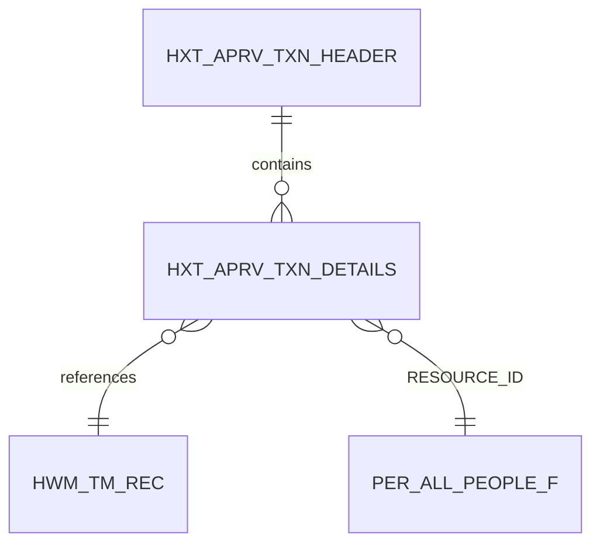

## What Is This Table?

`HXT_APRV_TXN_DETAILS` stores the **line-level details** of approval transactions for time cards. When a worker submits their time card and it enters the approval workflow, this table captures the granular data — which specific time entries are being approved, what amounts, and for which dates.

Think of the relationship this way:
- `HXT_APRV_TXN_HEADER` = "A time card was submitted for approval" (the envelope)
- `HXT_APRV_TXN_DETAILS` = "Here's exactly what's inside" (the contents)

## Why Does This Matter?

When managers approve a time card, they're not just rubber-stamping a total number. The approval system tracks *each line item* separately, which enables:

- **Partial approvals**: A manager could theoretically approve some entries and reject others
- **Audit trails**: Regulators and auditors can see exactly what was approved at the line level
- **Downstream processing**: Payroll and project costing systems need the detail breakdown, not just totals

> **From the trenches**: When approval workflows break, this table is where you'll find the root cause. Look for entries stuck in intermediate states or entries that were expected but never created.

## Key Columns

| Column | Type | What It Means |
|---|---|---|
| `APRV_TXN_DETAIL_ID` | NUMBER | Primary key for this detail row. |
| `APRV_TXN_HEADER_ID` | NUMBER | FK to the parent header (`HXT_APRV_TXN_HEADER`). |
| `TM_REC_ID` | NUMBER | Links back to the original time record being approved. |
| `TM_REC_VERSION` | NUMBER | The specific version of the time record at approval time. |
| `REF_DATE` | DATE | The date this detail line refers to. |
| `MEASURE` | NUMBER | Hours/quantity being approved for this line. |
| `UNIT_OF_MEASURE` | VARCHAR2(30) | Usually `'HOURS'`. |
| `APPROVAL_STATUS` | VARCHAR2(30) | Status of this specific line (PENDING, APPROVED, REJECTED). |
| `COMMENTS` | VARCHAR2(2000) | Approval/rejection comments from the manager. |
| `RESOURCE_ID` | NUMBER | The worker whose time this relates to. |
| `ENTERPRISE_ID` | NUMBER | Enterprise context. |

## Relationships



## Common Queries

### Find all pending approval details for a manager's team

```sql
SELECT 
    d.APRV_TXN_DETAIL_ID,
    p.FULL_NAME AS worker_name,
    d.REF_DATE,
    d.MEASURE,
    d.APPROVAL_STATUS,
    h.SUBMISSION_DATE
FROM 
    HXT_APRV_TXN_DETAILS d
    JOIN HXT_APRV_TXN_HEADER h ON d.APRV_TXN_HEADER_ID = h.APRV_TXN_HEADER_ID
    JOIN PER_ALL_PEOPLE_F p ON d.RESOURCE_ID = p.PERSON_ID
        AND SYSDATE BETWEEN p.EFFECTIVE_START_DATE AND p.EFFECTIVE_END_DATE
WHERE 
    d.APPROVAL_STATUS = 'PENDING'
ORDER BY 
    h.SUBMISSION_DATE, d.REF_DATE;
```

### Check for orphaned approval details (no matching time record)

```sql
SELECT 
    d.APRV_TXN_DETAIL_ID,
    d.TM_REC_ID,
    d.REF_DATE,
    d.MEASURE
FROM 
    HXT_APRV_TXN_DETAILS d
    LEFT JOIN HWM_TM_REC r ON d.TM_REC_ID = r.TM_REC_ID
WHERE 
    r.TM_REC_ID IS NULL
    AND d.REF_DATE >= ADD_MONTHS(SYSDATE, -1);
```

## Developer Tips

- **Version matters**: `TM_REC_VERSION` captures the version of the time record *at the moment of approval*. If the worker edits the time card after submission, the approval detail still references the original version.
- **Comments are gold**: When debugging rejection issues, always check the `COMMENTS` column. Managers are required to provide rejection reasons in most configurations.
- **Pair with the header**: Never query this table in isolation. Always join to `HXT_APRV_TXN_HEADER` for the submission context (who submitted, when, overall status).
