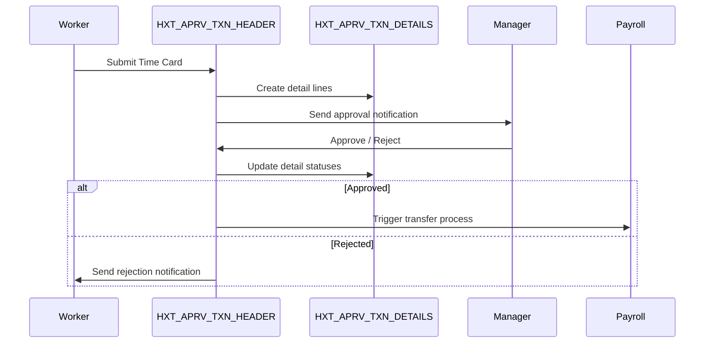

## What Is This Table?

`HXT_APRV_TXN_HEADER` is the **header record** for time card approval transactions. When a worker clicks "Submit" on their time card, this table creates a single header row that represents the entire approval request.

It's the "envelope" that wraps all the detail lines in `HXT_APRV_TXN_DETAILS`. One header = one time card submission = one approval action from the manager.

## Real-World Context

Here's how it fits into the worker's day:

1. Worker fills out their weekly time card (creates `HWM_TM_REC` entries)
2. Worker clicks **Submit** → a row is created in `HXT_APRV_TXN_HEADER`
3. Individual time entries become detail rows in `HXT_APRV_TXN_DETAILS`
4. Manager receives notification → opens the approval task
5. Manager approves/rejects → header status updates accordingly

## Key Columns

| Column | Type | What It Means |
|---|---|---|
| `APRV_TXN_HEADER_ID` | NUMBER | Primary key. Identifies this approval transaction. |
| `RESOURCE_ID` | NUMBER | The worker who submitted the time card. |
| `RESOURCE_TYPE` | VARCHAR2(30) | Usually `'PERSON'`. |
| `SUBMISSION_DATE` | TIMESTAMP | When the worker hit Submit. |
| `APPROVAL_DATE` | TIMESTAMP | When the manager took action (NULL if still pending). |
| `APPROVAL_STATUS` | VARCHAR2(30) | Overall status: `PENDING`, `APPROVED`, `REJECTED`. |
| `APPROVER_ID` | NUMBER | Person ID of the manager who approved/rejected. |
| `TM_REC_GRP_ID` | NUMBER | Links to the time record group that was submitted. |
| `PERIOD_START_DATE` | DATE | Start of the time period being approved. |
| `PERIOD_END_DATE` | DATE | End of the time period. |
| `TOTAL_HOURS` | NUMBER | Denormalized total hours for quick display. |
| `COMMENTS` | VARCHAR2(2000) | Manager's comments (especially on rejection). |
| `ENTERPRISE_ID` | NUMBER | Enterprise context. |

## The Approval Flow Visualized



## Common Queries

### Find all pending approvals with worker names

```sql
SELECT 
    h.APRV_TXN_HEADER_ID,
    p.FULL_NAME AS worker,
    h.SUBMISSION_DATE,
    h.PERIOD_START_DATE,
    h.PERIOD_END_DATE,
    h.TOTAL_HOURS,
    h.APPROVAL_STATUS
FROM 
    HXT_APRV_TXN_HEADER h
    JOIN PER_ALL_PEOPLE_F p ON h.RESOURCE_ID = p.PERSON_ID
        AND SYSDATE BETWEEN p.EFFECTIVE_START_DATE AND p.EFFECTIVE_END_DATE
WHERE 
    h.APPROVAL_STATUS = 'PENDING'
ORDER BY 
    h.SUBMISSION_DATE;
```

### Approval turnaround time report

```sql
SELECT 
    p.FULL_NAME AS approver_name,
    AVG(h.APPROVAL_DATE - h.SUBMISSION_DATE) AS avg_days_to_approve,
    COUNT(*) AS total_approvals
FROM 
    HXT_APRV_TXN_HEADER h
    JOIN PER_ALL_PEOPLE_F p ON h.APPROVER_ID = p.PERSON_ID
        AND SYSDATE BETWEEN p.EFFECTIVE_START_DATE AND p.EFFECTIVE_END_DATE
WHERE 
    h.APPROVAL_STATUS = 'APPROVED'
    AND h.SUBMISSION_DATE >= ADD_MONTHS(SYSDATE, -3)
GROUP BY 
    p.FULL_NAME
ORDER BY 
    avg_days_to_approve DESC;
```

## Developer Tips

- **Submission ≠ Approval**: Don't confuse `SUBMISSION_DATE` with `APPROVAL_DATE`. A time card can sit in PENDING status for days.
- **Total hours is denormalized**: `TOTAL_HOURS` is a convenience column. For exact numbers, always sum from `HXT_APRV_TXN_DETAILS.MEASURE`.
- **Approver chain**: In multi-level approval setups, there may be multiple header rows or the header gets updated as it moves through the chain. Check your workflow configuration.
- **Rejection handling**: When a time card is rejected and resubmitted, a *new* header row is typically created. The old one stays as a historical record.
