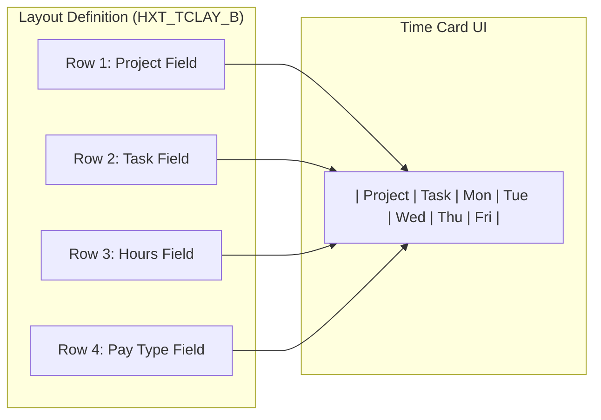

## What Is This Table?

`HXT_TCLAY_B` defines the **layout and structure** of time card user interfaces. It's the configuration table that controls what workers see when they open their time card — which fields are visible, the column order, what's mandatory, and how the grid is organized.

If you've ever wondered "Why does the time card show Project and Task columns for department A but not department B?" — this table holds the answer.

## Why Does This Matter?

Oracle Fusion's time card UI is highly configurable. Different worker populations may need different time card layouts:

- **Office workers**: Simple calendar view with hours per day
- **Project workers**: Need Project, Task, and Expenditure Type columns
- **Manufacturing**: Might need Work Order and Operation columns
- **Consultants**: Need Client, Engagement, and Billing Rate fields

This table stores those layout definitions that drive the time card rendering.

## Key Columns

| Column | Type | What It Means |
|---|---|---|
| `TCLAY_ID` | NUMBER | Primary key — identifies this layout definition. |
| `LAYOUT_NAME` | VARCHAR2(80) | Human-readable name (e.g., "Project Time Card Layout"). |
| `LAYOUT_TYPE` | VARCHAR2(30) | Type of layout — determines rendering behavior. |
| `LAYOUT_CODE` | VARCHAR2(30) | Short code for programmatic reference. |
| `DISPLAY_SEQUENCE` | NUMBER | Order in which fields/columns appear in the UI. |
| `FIELD_NAME` | VARCHAR2(80) | The actual field being displayed (e.g., "PROJECT_ID", "TASK_ID"). |
| `FIELD_LABEL` | VARCHAR2(240) | What the user sees as the column header. |
| `MANDATORY_FLAG` | VARCHAR2(1) | `Y` if this field is required for time entry. |
| `DISPLAY_FLAG` | VARCHAR2(1) | `Y` if the field is visible, `N` if hidden. |
| `DEFAULT_VALUE` | VARCHAR2(240) | Pre-populated value (if any). |
| `LOV_TYPE` | VARCHAR2(30) | If the field has a dropdown/LOV, what type of list. |
| `ENTERPRISE_ID` | NUMBER | Enterprise context. |
| `EFFECTIVE_START_DATE` | DATE | When this layout becomes active. |
| `EFFECTIVE_END_DATE` | DATE | When this layout expires. |

## How Layouts Work



## Common Queries

### List all active layouts

```sql
SELECT 
    TCLAY_ID,
    LAYOUT_NAME,
    LAYOUT_CODE,
    LAYOUT_TYPE
FROM 
    HXT_TCLAY_B
WHERE 
    SYSDATE BETWEEN EFFECTIVE_START_DATE 
        AND NVL(EFFECTIVE_END_DATE, TO_DATE('4712-12-31', 'YYYY-MM-DD'))
GROUP BY 
    TCLAY_ID, LAYOUT_NAME, LAYOUT_CODE, LAYOUT_TYPE
ORDER BY 
    LAYOUT_NAME;
```

### See the field configuration for a specific layout

```sql
SELECT 
    FIELD_NAME,
    FIELD_LABEL,
    DISPLAY_SEQUENCE,
    MANDATORY_FLAG,
    DISPLAY_FLAG,
    DEFAULT_VALUE
FROM 
    HXT_TCLAY_B
WHERE 
    LAYOUT_CODE = :layout_code
    AND SYSDATE BETWEEN EFFECTIVE_START_DATE 
        AND NVL(EFFECTIVE_END_DATE, TO_DATE('4712-12-31', 'YYYY-MM-DD'))
ORDER BY 
    DISPLAY_SEQUENCE;
```

## Developer Tips

- **Date-effective**: Layouts are date-tracked. This means you can set up a new layout to activate on a specific date (like the start of a new fiscal year) without disrupting current users.
- **Testing layouts**: In sandbox environments, create test layouts with `EFFECTIVE_START_DATE = SYSDATE` to preview changes without affecting other users.
- **Performance impact**: Complex layouts with many LOV fields can slow down time card rendering. Keep layouts lean — only show fields workers actually need.
- **The `_B` suffix**: Following Oracle's naming convention, `_B` means this is the base (non-translated) table. Translation data may exist in a `_TL` variant.
