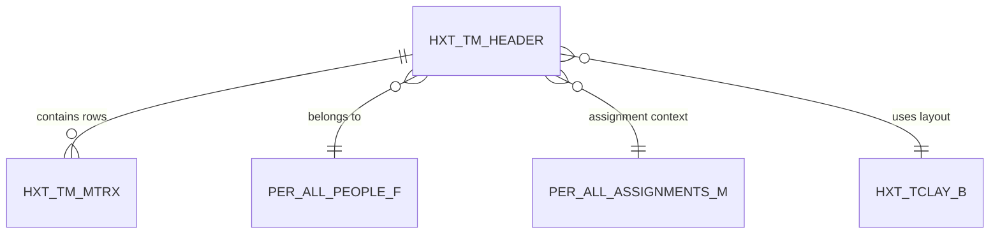

## What Is This Table?

`HXT_TM_HEADER` is the **header table for time matrices**. A time matrix is essentially a structured grid that organizes how time data is collected and displayed. Think of it as the container for the weekly time card grid — the part that says "this is John's time card for the week of May 5."

While `HWM_TM_REC` stores the raw time building blocks, this table provides a higher-level organizational structure specifically designed for the time card matrix UI.

## How Is It Different from HWM_TM_REC_GRP?

Good question — it can be confusing:

| Table | Role | Think of it as... |
|---|---|---|
| `HWM_TM_REC_GRP` | Groups time records logically | The data model grouping |
| `HXT_TM_HEADER` | Represents the UI time matrix | The presentation layer header |
| `HWM_TM_REC` | Individual time entries | The actual data |

The `HXT` prefix tables (`HXT_TM_HEADER`, `HXT_TM_MTRX`) are more about the **UI representation** of time data, while `HWM` tables are about the **underlying data model**.

## Key Columns

| Column | Type | What It Means |
|---|---|---|
| `TM_HEADER_ID` | NUMBER | Primary key. |
| `PERSON_ID` | NUMBER | The worker who owns this time matrix. FK to `PER_ALL_PEOPLE_F`. |
| `ASSIGNMENT_ID` | NUMBER | The specific work assignment context. FK to `PER_ALL_ASSIGNMENTS_M`. |
| `PERIOD_START_DATE` | DATE | Start of the time period (usually Monday). |
| `PERIOD_END_DATE` | DATE | End of the time period (usually Sunday). |
| `PERIOD_TYPE` | VARCHAR2(30) | Type of period — `WEEKLY`, `BIWEEKLY`, `SEMIMONTHLY`, etc. |
| `STATUS` | VARCHAR2(30) | Current status of this time matrix. |
| `LAYOUT_ID` | NUMBER | FK to `HXT_TCLAY_B` — which layout drives this matrix's UI. |
| `TOTAL_HOURS` | NUMBER | Denormalized total hours for this period. |
| `ENTERPRISE_ID` | NUMBER | Enterprise context. |

## Relationships



## Common Queries

### List all time matrices for a person in a date range

```sql
SELECT 
    h.TM_HEADER_ID,
    h.PERIOD_START_DATE,
    h.PERIOD_END_DATE,
    h.PERIOD_TYPE,
    h.STATUS,
    h.TOTAL_HOURS
FROM 
    HXT_TM_HEADER h
WHERE 
    h.PERSON_ID = :person_id
    AND h.PERIOD_START_DATE >= :start_date
    AND h.PERIOD_END_DATE <= :end_date
ORDER BY 
    h.PERIOD_START_DATE DESC;
```

### Find workers with missing time matrices for a period

```sql
SELECT 
    p.PERSON_NUMBER,
    p.FULL_NAME
FROM 
    PER_ALL_PEOPLE_F p
    JOIN PER_ALL_ASSIGNMENTS_M a ON p.PERSON_ID = a.PERSON_ID
        AND SYSDATE BETWEEN a.EFFECTIVE_START_DATE AND a.EFFECTIVE_END_DATE
    LEFT JOIN HXT_TM_HEADER h ON p.PERSON_ID = h.PERSON_ID
        AND h.PERIOD_START_DATE = :target_period_start
WHERE 
    SYSDATE BETWEEN p.EFFECTIVE_START_DATE AND p.EFFECTIVE_END_DATE
    AND a.ASSIGNMENT_STATUS_TYPE = 'ACTIVE'
    AND h.TM_HEADER_ID IS NULL;
```

## Developer Tips

- **Period types vary**: Not every organization uses weekly time cards. Some use biweekly or semimonthly. Always check `PERIOD_TYPE`.
- **Multiple assignments**: A worker with multiple assignments (e.g., a part-time job in two departments) may have multiple time matrix headers for the same period.
- **Layout drives behavior**: The `LAYOUT_ID` determines what fields workers see. If someone reports their time card looks different, check which layout their matrix is using.
- **TOTAL_HOURS is a summary**: Like many Oracle denormalized fields, don't rely solely on this. The real source is the `HXT_TM_MTRX` detail rows.
