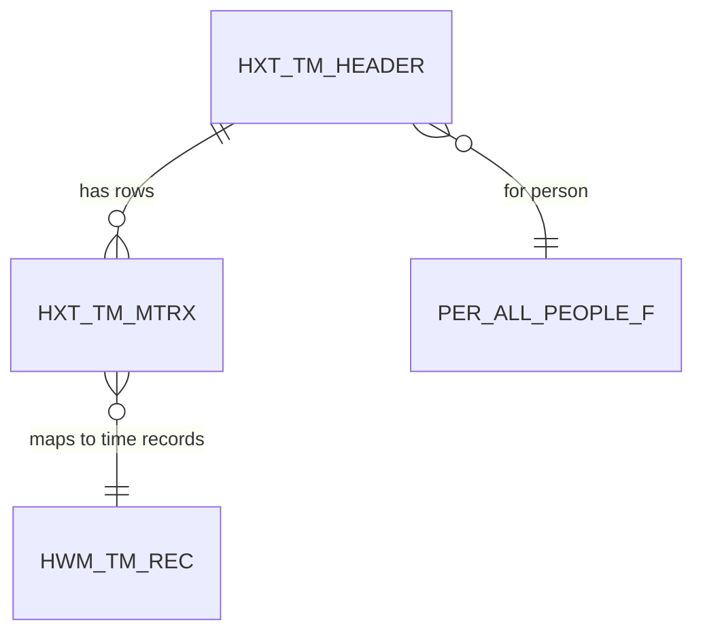

## What Is This Table?

`HXT_TM_MTRX` stores the **individual rows of a time matrix** — the actual grid data that workers fill in. If `HXT_TM_HEADER` is the time card container, this table is each row in that card.

Each row in the time matrix typically represents a unique combination of attributes (e.g., Project + Task + Pay Type) with daily time values spread across the columns.

## Visualizing the Matrix

Here's what a time card grid looks like in the UI — and how this table maps to it:

```
┌────────────┬──────────┬──────┬──────┬──────┬──────┬──────┬───────┐
│ Project    │ Task     │ Mon  │ Tue  │ Wed  │ Thu  │ Fri  │ Total │
├────────────┼──────────┼──────┼──────┼──────┼──────┼──────┼───────┤
│ ERP Impl.  │ Dev      │ 8.0  │ 8.0  │ 4.0  │ 8.0  │ 8.0  │ 36.0  │  ← Row 1 in HXT_TM_MTRX
│ ERP Impl.  │ Testing  │ 0.0  │ 0.0  │ 4.0  │ 0.0  │ 0.0  │  4.0  │  ← Row 2 in HXT_TM_MTRX
│ Internal   │ Training │ 0.0  │ 0.0  │ 0.0  │ 0.0  │ 2.0  │  2.0  │  ← Row 3 in HXT_TM_MTRX
└────────────┴──────────┴──────┴──────┴──────┴──────┴──────┴───────┘
                                                           Total: 42.0 hrs
```

## Key Columns

| Column | Type | What It Means |
|---|---|---|
| `TM_MTRX_ID` | NUMBER | Primary key for this matrix row. |
| `TM_HEADER_ID` | NUMBER | FK to `HXT_TM_HEADER` — which time card this row belongs to. |
| `ROW_SEQUENCE` | NUMBER | Position of this row in the grid (1st row, 2nd row, etc.). |
| `PROJECT_ID` | NUMBER | Project reference (if project time tracking is enabled). |
| `TASK_ID` | NUMBER | Task within the project. |
| `PAY_TYPE` | VARCHAR2(30) | Type of pay — Regular, Overtime, Double Time, etc. |
| `DAY1_HOURS` | NUMBER | Hours for the 1st day of the period. |
| `DAY2_HOURS` | NUMBER | Hours for the 2nd day. |
| `DAY3_HOURS` | NUMBER | Hours for the 3rd day. |
| `DAY4_HOURS` | NUMBER | Hours for the 4th day. |
| `DAY5_HOURS` | NUMBER | Hours for the 5th day. |
| `DAY6_HOURS` | NUMBER | Hours for the 6th day (if applicable). |
| `DAY7_HOURS` | NUMBER | Hours for the 7th day (if applicable). |
| `TOTAL_HOURS` | NUMBER | Row total. Should equal SUM of day hours. |
| `STATUS` | VARCHAR2(30) | Status of this specific row. |
| `ENTERPRISE_ID` | NUMBER | Enterprise context. |

### Attribute/DFF Columns

| Column | Type | Purpose |
|---|---|---|
| `ATTRIBUTE1` through `ATTRIBUTE15` | VARCHAR2 | Descriptive flexfield segments for additional data capture |
| `ATTRIBUTE_CATEGORY` | VARCHAR2 | DFF context value |

## Relationships



## Common Queries

### Get the full time card grid for a person

```sql
SELECT 
    m.ROW_SEQUENCE,
    m.PROJECT_ID,
    m.TASK_ID,
    m.PAY_TYPE,
    m.DAY1_HOURS AS mon,
    m.DAY2_HOURS AS tue,
    m.DAY3_HOURS AS wed,
    m.DAY4_HOURS AS thu,
    m.DAY5_HOURS AS fri,
    m.DAY6_HOURS AS sat,
    m.DAY7_HOURS AS sun,
    m.TOTAL_HOURS
FROM 
    HXT_TM_MTRX m
    JOIN HXT_TM_HEADER h ON m.TM_HEADER_ID = h.TM_HEADER_ID
WHERE 
    h.PERSON_ID = :person_id
    AND h.PERIOD_START_DATE = :week_start
ORDER BY 
    m.ROW_SEQUENCE;
```

### Find overtime entries across the team

```sql
SELECT 
    p.FULL_NAME,
    h.PERIOD_START_DATE,
    m.PAY_TYPE,
    m.TOTAL_HOURS
FROM 
    HXT_TM_MTRX m
    JOIN HXT_TM_HEADER h ON m.TM_HEADER_ID = h.TM_HEADER_ID
    JOIN PER_ALL_PEOPLE_F p ON h.PERSON_ID = p.PERSON_ID
        AND SYSDATE BETWEEN p.EFFECTIVE_START_DATE AND p.EFFECTIVE_END_DATE
WHERE 
    m.PAY_TYPE IN ('OT', 'OVERTIME', 'DOUBLE_TIME')
    AND h.PERIOD_START_DATE >= ADD_MONTHS(SYSDATE, -1)
    AND m.TOTAL_HOURS > 0
ORDER BY 
    m.TOTAL_HOURS DESC;
```

## Developer Tips

- **DAY1 ≠ Monday**: `DAY1_HOURS` corresponds to the first day of `PERIOD_START_DATE` from the header. If the period starts on Sunday, then `DAY1_HOURS` = Sunday. Always cross-reference with the header's date range.
- **Sparse rows**: Not all day columns will have values. A worker who only worked Mon-Fri will have `DAY6_HOURS` and `DAY7_HOURS` as NULL or 0.
- **DFF attributes**: Use `ATTRIBUTE1-15` for project costing dimensions, client codes, or any custom data your implementation captures. Check `ATTRIBUTE_CATEGORY` for the DFF context.
- **Row sequence gaps**: Don't assume `ROW_SEQUENCE` is contiguous. If a worker deletes a row from their time card, the remaining rows keep their original sequence numbers.
