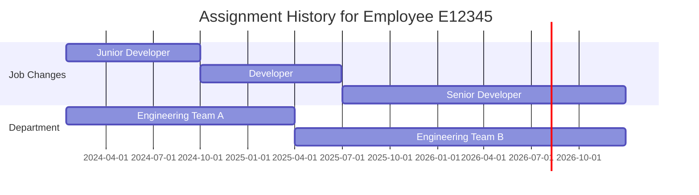

## What Is This Table?

`PER_ALL_ASSIGNMENTS_M` is one of the most important tables in Oracle Fusion HCM. It stores **all work assignments** for every person in the system. An assignment represents a worker's job context — their position, department, job, grade, location, manager, and all the organizational details that define *where and how* they work.

The `_M` suffix stands for "Merged" — Oracle merges multiple underlying assignment tables into this single view for easier querying.

## Why Is This Table So Important?

Almost every HCM report, integration, or business process needs assignment data. It answers questions like:

- **Where does this person work?** → Department, Location
- **What's their job?** → Job, Position, Grade
- **Who's their manager?** → Manager ID
- **Are they active?** → Assignment Status
- **What type of worker are they?** → Employee, Contingent Worker, etc.

> **Pro tip**: When someone says "get me a list of all employees," what they really want is this table joined to `PER_ALL_PEOPLE_F`. The person table tells you *who* they are; the assignment table tells you *what* they do.

## Key Columns

| Column | Type | What It Means |
|---|---|---|
| `ASSIGNMENT_ID` | NUMBER | Primary key. Unique identifier for this assignment. |
| `PERSON_ID` | NUMBER | FK to `PER_ALL_PEOPLE_F`. The person who holds this assignment. |
| `EFFECTIVE_START_DATE` | DATE | Date tracking: when this version of the assignment starts. |
| `EFFECTIVE_END_DATE` | DATE | Date tracking: when this version ends. |
| `ASSIGNMENT_NUMBER` | VARCHAR2(30) | Human-readable assignment number (e.g., "E12345"). |
| `ASSIGNMENT_NAME` | VARCHAR2(80) | Name of the assignment. |
| `ASSIGNMENT_TYPE` | VARCHAR2(30) | `E` (Employee), `C` (Contingent Worker), `N` (Non-worker), etc. |
| `ASSIGNMENT_STATUS_TYPE` | VARCHAR2(30) | `ACTIVE`, `INACTIVE`, `SUSPENDED`, `TERMINATED`. |
| `PRIMARY_FLAG` | VARCHAR2(1) | `Y` if this is the worker's primary assignment. |
| `BUSINESS_UNIT_ID` | NUMBER | The business unit this assignment belongs to. |
| `DEPARTMENT_ID` | NUMBER | Department. |
| `JOB_ID` | NUMBER | Job classification. |
| `POSITION_ID` | NUMBER | Specific position held. |
| `GRADE_ID` | NUMBER | Grade/level. |
| `LOCATION_ID` | NUMBER | Work location. |
| `MANAGER_ASSIGNMENT_ID` | NUMBER | The assignment ID of this person's manager. |
| `MANAGER_ID` | NUMBER | Person ID of the manager. |
| `LEGAL_ENTITY_ID` | NUMBER | Legal employer. |
| `PAYROLL_ID` | NUMBER | Which payroll this assignment is on. |
| `PEOPLE_GROUP_ID` | NUMBER | People group for additional categorization. |
| `NORMAL_HOURS` | NUMBER | Contracted hours (e.g., 40 per week). |
| `FREQUENCY` | VARCHAR2(30) | Frequency of normal hours (WEEKLY, MONTHLY, etc.). |

## Date Tracking — The Critical Concept

This table is **date-effective** (also called "date-tracked"). That means for a single `ASSIGNMENT_ID`, there can be many rows — each representing the assignment's state during a specific date range.



Each row in the Gantt above is a separate row in `PER_ALL_ASSIGNMENTS_M` with the same `ASSIGNMENT_ID` but different date ranges.

### The Magic Query Pattern

To get the **current** assignment, always add this filter:

```sql
WHERE SYSDATE BETWEEN EFFECTIVE_START_DATE AND EFFECTIVE_END_DATE
```

## Common Queries

### Get all active employees with their department and job

```sql
SELECT 
    p.PERSON_NUMBER,
    p.FULL_NAME,
    a.ASSIGNMENT_NUMBER,
    a.ASSIGNMENT_STATUS_TYPE,
    a.DEPARTMENT_ID,
    a.JOB_ID,
    a.POSITION_ID,
    a.LOCATION_ID,
    a.NORMAL_HOURS
FROM 
    PER_ALL_ASSIGNMENTS_M a
    JOIN PER_ALL_PEOPLE_F p ON a.PERSON_ID = p.PERSON_ID
        AND SYSDATE BETWEEN p.EFFECTIVE_START_DATE AND p.EFFECTIVE_END_DATE
WHERE 
    SYSDATE BETWEEN a.EFFECTIVE_START_DATE AND a.EFFECTIVE_END_DATE
    AND a.ASSIGNMENT_STATUS_TYPE = 'ACTIVE'
    AND a.PRIMARY_FLAG = 'Y'
    AND a.ASSIGNMENT_TYPE = 'E'
ORDER BY 
    p.FULL_NAME;
```

### Get a person's assignment history

```sql
SELECT 
    a.EFFECTIVE_START_DATE,
    a.EFFECTIVE_END_DATE,
    a.ASSIGNMENT_STATUS_TYPE,
    a.JOB_ID,
    a.DEPARTMENT_ID,
    a.POSITION_ID,
    a.GRADE_ID
FROM 
    PER_ALL_ASSIGNMENTS_M a
WHERE 
    a.PERSON_ID = :person_id
    AND a.PRIMARY_FLAG = 'Y'
ORDER BY 
    a.EFFECTIVE_START_DATE;
```

### Find workers by manager

```sql
SELECT 
    p.FULL_NAME AS employee,
    a.ASSIGNMENT_NUMBER,
    a.DEPARTMENT_ID
FROM 
    PER_ALL_ASSIGNMENTS_M a
    JOIN PER_ALL_PEOPLE_F p ON a.PERSON_ID = p.PERSON_ID
        AND SYSDATE BETWEEN p.EFFECTIVE_START_DATE AND p.EFFECTIVE_END_DATE
WHERE 
    a.MANAGER_ID = :manager_person_id
    AND SYSDATE BETWEEN a.EFFECTIVE_START_DATE AND a.EFFECTIVE_END_DATE
    AND a.ASSIGNMENT_STATUS_TYPE = 'ACTIVE'
ORDER BY 
    p.FULL_NAME;
```

## Developer Tips

- **Always date-filter**: Forgetting `SYSDATE BETWEEN EFFECTIVE_START_DATE AND EFFECTIVE_END_DATE` will give you duplicate rows across all historical versions. This is the #1 mistake.
- **Primary assignment**: A person can have multiple assignments (e.g., a professor teaching in two departments). Use `PRIMARY_FLAG = 'Y'` for the main one.
- **Assignment type matters**: `E` = Employee, `C` = Contingent Worker. If you want "all workers," include both. If you want "employees only," filter to `E`.
- **End-dated rows**: `EFFECTIVE_END_DATE = '4712-12-31'` means the record is currently active with no planned end date. This is Oracle's convention for "forever."
- **Manager chain**: To build an org chart, recursively follow `MANAGER_ID` up the chain. Be careful of circular references in bad data.
