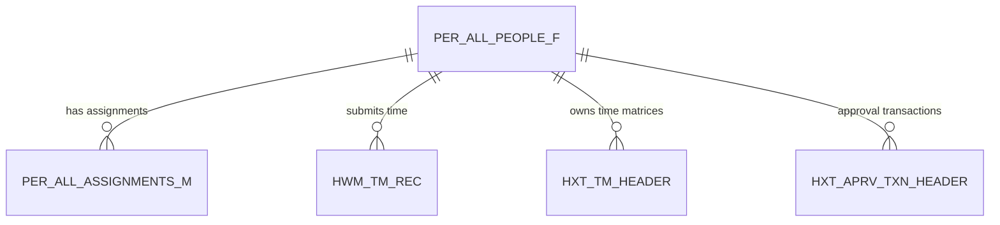

## What Is This Table?

`PER_ALL_PEOPLE_F` is the **foundation table** of Oracle Fusion HCM. Every person in the system — employees, contingent workers, applicants, contacts — has a record here. If `PER_ALL_ASSIGNMENTS_M` tells you *what a person does*, this table tells you *who they are*.

The `_F` suffix stands for "Full" — meaning this table holds the complete, date-effective history of a person's core data.

## Why Is It Important?

This is literally the first table you'll join to in any HCM query. Need a person's name? This table. Person number? This table. Need to check if someone is even in the system? This table.

> **Real talk**: You can't write a useful HCM query without this table. Get comfortable with it — it'll be in 90% of your queries.

## Key Columns

| Column | Type | What It Means |
|---|---|---|
| `PERSON_ID` | NUMBER | Primary key — uniquely identifies a person across the entire system. |
| `EFFECTIVE_START_DATE` | DATE | Date tracking: when this version of the person record starts. |
| `EFFECTIVE_END_DATE` | DATE | Date tracking: when this version ends. |
| `PERSON_NUMBER` | VARCHAR2(30) | Business key — the employee/person number displayed in the UI. |
| `START_DATE` | DATE | The date the person first appeared in the system (hire date for employees). |
| `DATE_OF_BIRTH` | DATE | Date of birth. |
| `BLOOD_TYPE` | VARCHAR2(30) | Blood type (used in some regions). |
| `COUNTRY_OF_BIRTH` | VARCHAR2(30) | Country where the person was born. |
| `PRIMARY_EMAIL_ID` | NUMBER | FK to the primary email address record. |
| `PRIMARY_PHONE_ID` | NUMBER | FK to the primary phone record. |
| `PRIMARY_NID_ID` | NUMBER | FK to the primary national identifier (SSN, PAN, etc.). |
| `PRIMARY_NID_NUMBER` | VARCHAR2(30) | Denormalized national ID number. |
| `MAILING_ADDRESS_ID` | NUMBER | FK to the mailing address. |
| `WAIVE_DATA_PROTECT` | VARCHAR2(30) | Data protection waiver flag. |

### Who Column Audit Fields

| Column | Type | Purpose |
|---|---|---|
| `CREATED_BY` | VARCHAR2(64) | User who created the record |
| `CREATION_DATE` | TIMESTAMP | When the record was created |
| `LAST_UPDATED_BY` | VARCHAR2(64) | Last modifier |
| `LAST_UPDATE_DATE` | TIMESTAMP | Last modification timestamp |
| `OBJECT_VERSION_NUMBER` | NUMBER | Optimistic locking counter |

### Descriptive Flexfield (DFF) Columns

This table has `ATTRIBUTE1` through `ATTRIBUTE_NUMBER5` columns for the **All People Attributes (PER_ALL_PEOPLE_DFF)** flexfield context. These are custom fields defined by your implementation team.

## Date Tracking — How It Works

Like `PER_ALL_ASSIGNMENTS_M`, this table is date-effective. A person's data can change over time, and Oracle keeps a historical trail:

```
PERSON_ID: 12345
┌─────────────────────┬─────────────────────┬───────────────┐
│ EFFECTIVE_START_DATE │ EFFECTIVE_END_DATE  │ What Changed  │
├─────────────────────┼─────────────────────┼───────────────┤
│ 2024-01-15          │ 2024-06-30          │ Initial hire  │
│ 2024-07-01          │ 2025-03-31          │ Name change   │
│ 2025-04-01          │ 4712-12-31          │ Current       │
└─────────────────────┴─────────────────────┴───────────────┘
```

> **The 4712-12-31 convention**: Oracle uses December 31, 4712 AD as "end of time." When you see this date, it means the record is currently active with no planned end.

## Common Queries

### Get current person details

```sql
SELECT 
    p.PERSON_ID,
    p.PERSON_NUMBER,
    p.START_DATE,
    p.DATE_OF_BIRTH,
    p.COUNTRY_OF_BIRTH,
    p.PRIMARY_NID_NUMBER
FROM 
    PER_ALL_PEOPLE_F p
WHERE 
    p.PERSON_ID = :person_id
    AND SYSDATE BETWEEN p.EFFECTIVE_START_DATE AND p.EFFECTIVE_END_DATE;
```

### Count all active people by type

```sql
SELECT 
    a.ASSIGNMENT_TYPE,
    COUNT(DISTINCT p.PERSON_ID) AS headcount
FROM 
    PER_ALL_PEOPLE_F p
    JOIN PER_ALL_ASSIGNMENTS_M a ON p.PERSON_ID = a.PERSON_ID
        AND SYSDATE BETWEEN a.EFFECTIVE_START_DATE AND a.EFFECTIVE_END_DATE
WHERE 
    SYSDATE BETWEEN p.EFFECTIVE_START_DATE AND p.EFFECTIVE_END_DATE
    AND a.ASSIGNMENT_STATUS_TYPE = 'ACTIVE'
    AND a.PRIMARY_FLAG = 'Y'
GROUP BY 
    a.ASSIGNMENT_TYPE;
```

### Find a person by person number

```sql
SELECT 
    p.PERSON_ID,
    p.PERSON_NUMBER,
    p.START_DATE,
    a.ASSIGNMENT_NUMBER,
    a.ASSIGNMENT_STATUS_TYPE
FROM 
    PER_ALL_PEOPLE_F p
    JOIN PER_ALL_ASSIGNMENTS_M a ON p.PERSON_ID = a.PERSON_ID
        AND SYSDATE BETWEEN a.EFFECTIVE_START_DATE AND a.EFFECTIVE_END_DATE
WHERE 
    p.PERSON_NUMBER = :person_number
    AND SYSDATE BETWEEN p.EFFECTIVE_START_DATE AND p.EFFECTIVE_END_DATE
    AND a.PRIMARY_FLAG = 'Y';
```

## Relationships



## Developer Tips

- **Always date-filter**: Same as assignments — always include `SYSDATE BETWEEN EFFECTIVE_START_DATE AND EFFECTIVE_END_DATE` unless you specifically want history.
- **PERSON_ID vs PERSON_NUMBER**: `PERSON_ID` is the system-generated surrogate key (use for joins). `PERSON_NUMBER` is the business key (use for display and searches).
- **Name columns are in PER_ALL_PEOPLE_F... sort of**: In Oracle Fusion Cloud, names are actually stored in `PER_PERSON_NAMES_F` (a separate table) due to multi-language support. Join there for `FULL_NAME`, `FIRST_NAME`, `LAST_NAME`.
- **Minimal data**: This table stores core, non-legislation-specific data. Legislation-specific attributes (like marital status, veteran status) are in other tables like `PER_PEOPLE_LEGISLATIVE_F`.
- **DFF usage**: `ATTRIBUTE1` through `ATTRIBUTE_NUMBER5` are your custom extension points. Always check the DFF setup (`PER_ALL_PEOPLE_DFF`) to know what each attribute stores in your implementation.
